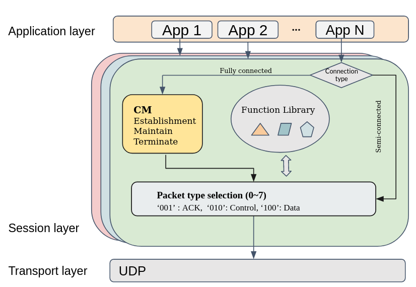

This project will first review the XTP protocols, and we will then
propose a simple protocol which not only adopts the idea of function
decomposition in XTP but also support protocol evolution, which is the
main difference from XTP protocol. In addition, our protocol enables
flexible extension of new control functions to adapt to the requirements
of new applications or services.

The expected delivery of the protocol will realize the following basic
functions:

-   Suitable selection of control functions upon application’s
    requirement,

-   Flexible adjustment of control functions during transmission,

-   Easy upgrade of protocol versions.

Similar to the idea of providing orthogonal control functions in XTP
where different control protocols shares the same packet header but with
different control segment. The benefits of this design are threefold:

-   Extensible. Since all control packets share the same packet header,
    there is no need to design extra packet structure for new control
    function. New control functions simply add their control information
    in the control segment without further concerns.

-   Easier management. With the same packet header, control packets are
    easier to be identified by simply inspecting the header where the
    types of the packets are indicated.

-   Lower overhead. Unlike TCP where each packet has a fixed length
    header, EXTP adopts the XTP-like fashion that equip different types
    of packet with different size of header. In this way the overall
    overhead can be reduced.

 {#fig:EXTP}
*Architecture of EXTP protocol*

The architecture of EXTP is shown in Fig. \@ref(fig:EXTP). EXTP establishes a
session module for each conversation between two applications. The
connection type is decided upon the service requirements. Two types of
connection is defined: The first type at the left-hand side of
Fig. \@ref(fig:EXTP) is the fully connection type where two ends can
send/receive data at the same time. The connection is managed by the
**connection management (CM)** module. Currently, we use the classic
three-way handshake for connection establishment and four-way handshake
to release connection. The second type at the right-hand side of
Fig. \@ref(fig:EXTP) is the semi-connected type connection where
half-connection service is provided.

Then the **Packet type selection** module is activated upon the
selection of connection type. In this module, we decompose the packet
header into two parts: common header and specific header. The common
header is used in every packet containing necessary information such as
protocol version, packet type, etc.. The specific header is further
classified into three subclasses, namely control header, data header,
and ACK header. Packet type selection module generates the corresponding packet
headers for each packet. For example, the acknowledgement packet will
only combine the common header and the ACK header. In this way, the
overall overhead can be reduced comparing with TCP.

It is worth noticing that the control functions are also configurable in
EXTP. A **function library** is constructed containing a range of
control functions, e.g., congestion control, error control, version
control, etc.. Each control function contains different control
mechanisms. Moreover, each control mechansim is assigned with a function
ID. For different application requirements, the function ID is written
in the control packet header to activate corresponding control function.
In this way, a flexible control configuration can be achieved. In
addition, the evolvability is realized via the version field in the
common packet header. The value in this field indicates the version of
current function library. To cope with the backward compatibility issue,
we restrict that only lower-version node is allowed to send data to
higher-version node, not vice-versa.

Finally, the generated packets are passed down to the transport layer.
In this project, the proposed EXTP runs on the UDP protocol. A more
detailed of the protocol is introduced in the following section.
